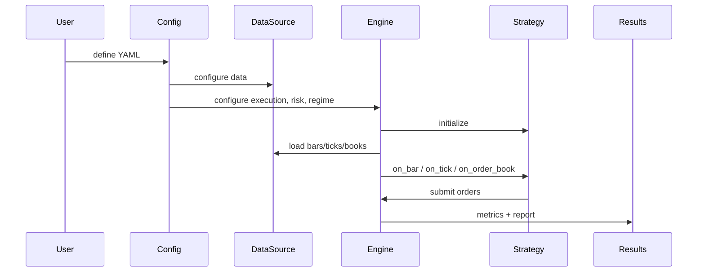

# Overview

RegimeFlow is a C++ trading engine with Python bindings. It supports repeatable backtests, regime-aware strategy selection, and live execution through broker adapters.

This documentation is organized around how quants work:

- Start with a backtest that runs locally and produces a report.
- Swap data sources and strategy logic without rewriting the pipeline.
- Add regime detection to drive strategy selection, risk limits, or execution cost modeling.
- Move from backtest to live by reusing the same strategy contract and event types.

## System Components

- **Data sources**: CSV, tick CSV, memory, mmap, API, Alpaca, Postgres, or plugin-based.
- **Validation**: schema, bounds, gaps, outliers, and trading hours checks.
- **Event pipeline**: bars, ticks, order books, and system events flow into the engine.
- **Strategies**: built-ins (moving average, pairs, harmonic) and plugins.
- **Regime detection**: constant, HMM, ensemble, or plugins.
- **Execution**: slippage, commission, market impact, and latency models.
- **Risk**: limits, stop-loss, and regime-aware risk rules.

## Typical Backtest Flow

## Key Design Guarantees

- **Consistent pipeline**: the same events and strategy lifecycle are used in backtest and live.
- **Pluggable subsystems**: data sources, execution, and detectors can be extended via plugins.
- **Deterministic testing**: local CSV-based backtests are reproducible by default.

## Glossary

- **Bar**: OHLCV aggregation over a fixed interval.
- **Tick**: a trade or quote update at sub-second resolution.
- **Order book**: Level-2 market depth snapshots.
- **Regime**: a market state label inferred from features.
- **Strategy**: decision logic that produces orders from events and context.
- **Execution model**: logic translating desired trades into fills with costs.

## Next Steps

- `getting-started/installation.md`
- `getting-started/quickstart.md`
- `guide/backtesting.md`
- `reference/configuration.md`
