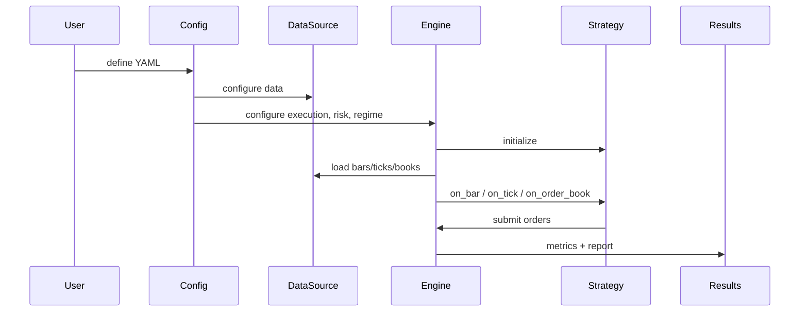

<section class="rf-hero">
  
Getting Started

  <h1>Build A Working Quant Workflow Fast</h1>
  

    RegimeFlow is a C++ trading engine with Python bindings for repeatable backtests,
    regime-aware strategy selection, and live execution through broker adapters. The
    fastest route through the docs is designed around how quant developers actually work.
  

  

    <a class="rf-button rf-button-primary" href="../quickstart/">Run the quickstart</a>
    <a class="rf-button rf-button-secondary" href="../../guide/backtesting/">Study the backtest flow</a>
  

  

    

      <strong>One event model</strong>
      Backtest and live share the same strategy contract and event pipeline.
    

    

      <strong>Code-aligned docs</strong>
      Reference pages and examples are expected to match the actual implementation.
    

    

      <strong>Research to execution</strong>
      Move from local runs to live adapters without changing the conceptual model.
    

  

</section>

## How Quants Typically Move Through RegimeFlow

  

    
    <h3>Start From Data</h3>
    
Choose a source, validate the data, and confirm the symbol and time assumptions before strategy logic enters the loop.

  

  

    
    <h3>Run The Engine</h3>
    
Drive bars, ticks, or books through one event pipeline that preserves strategy semantics across research and execution.

  

  

    
    <h3>Apply Regime And Risk</h3>
    
Use regime state to influence selection, sizing, risk limits, and execution-cost assumptions instead of treating it as a cosmetic metric.

  

  

    
    <h3>Carry It Live</h3>
    
Reuse the strategy contract with explicit broker boundaries, reconciliation, audit logging, and readiness constraints.

  

## System Components

- **Data sources**: CSV, tick CSV, memory, mmap, API, Alpaca, Postgres, or plugin-based.
- **Validation**: schema, bounds, gaps, outliers, and trading hours checks.
- **Event pipeline**: bars, ticks, order books, and system events flow into the engine.
- **Strategies**: built-ins (moving average, pairs, harmonic) and plugins.
- **Regime detection**: constant, HMM, ensemble, or plugins.
- **Execution**: slippage, commission, market impact, and latency models.
- **Risk**: limits, stop-loss, and regime-aware risk rules.

  <h2>Fastest Practical Path</h2>
  

    

      <h3>1. Install</h3>
      
<a href="../installation/">Installation</a> covers native builds, Python packaging, and environment assumptions.

    

    

      <h3>2. Run A Backtest</h3>
      
<a href="../quickstart/">Quickstart</a> gets you to a complete backtest and report with minimal setup noise.

    

    

      <h3>3. Adjust Strategy And Regime</h3>
      
<a href="../../guide/strategies/">Strategies</a> and <a href="../../guide/regime-detection/">Regime Detection</a> explain the major control surfaces.

    

    

      <h3>4. Validate Config</h3>
      
<a href="../../reference/configuration/">Configuration</a> is the authoritative reference once you move beyond defaults.

    

  

## Typical Backtest Flow

## Key Design Guarantees

- **Consistent pipeline**: the same events and strategy lifecycle are used in backtest and live.
- **Pluggable subsystems**: data sources, execution, and detectors can be extended via plugins.
- **Deterministic testing**: local CSV-based backtests are reproducible by default.

## Where To Go After This Page

  

    <h3>Backtesting</h3>
    
<a href="../../guide/backtesting/">Open the backtesting guide</a> if you want the operational workflow first.

  

  

    <h3>Execution Models</h3>
    
<a href="../../guide/execution-models/">Open execution models</a> if realism and fill assumptions matter most.

  

  

    <h3>Python Workflow</h3>
    
<a href="../../python/workflow/">Open the Python workflow</a> if your research loop lives in Python.

  

  

    <h3>Live Boundary</h3>
    
<a href="../../live/overview/">Open live overview</a> before treating a strategy as operationally ready.

  

## Glossary

- **Bar**: OHLCV aggregation over a fixed interval.
- **Tick**: a trade or quote update at sub-second resolution.
- **Order book**: Level-2 market depth snapshots.
- **Regime**: a market state label inferred from features.
- **Strategy**: decision logic that produces orders from events and context.
- **Execution model**: logic translating desired trades into fills with costs.

## Next Steps

- `getting-started/installation.md`
- `getting-started/quickstart.md`
- `guide/backtesting.md`
- `reference/configuration.md`
