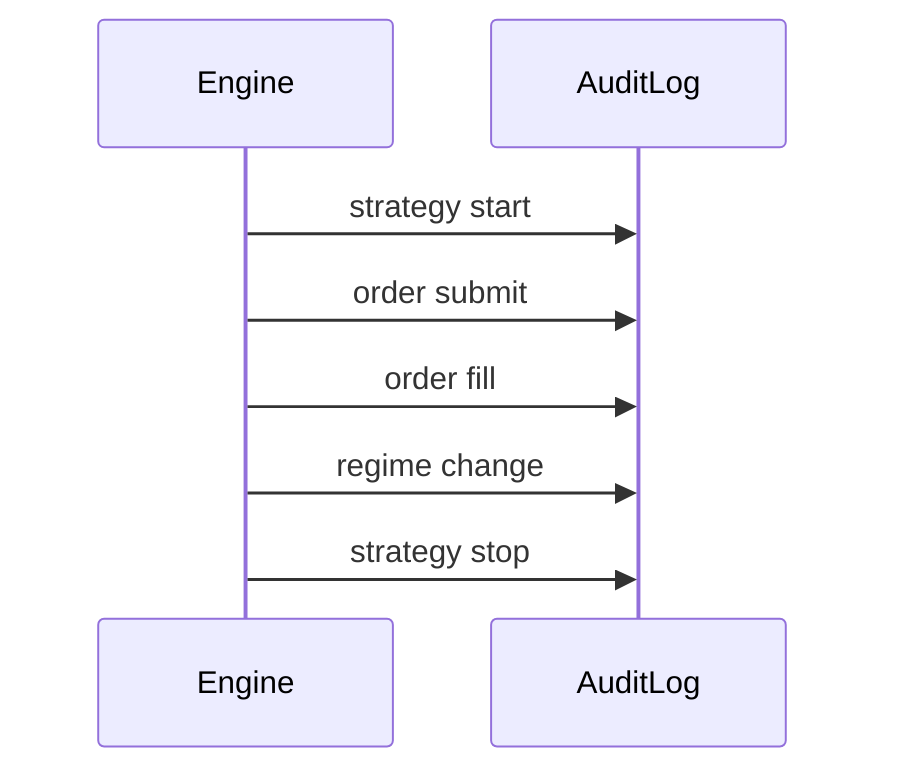

# Audit Logging

RegimeFlow records key events for traceability in both backtest and live trading.

## Audit Flow

## What It Means

- Every important action is recorded.
- This provides a reliable trail for debugging and compliance.

## Interpretation

Interpretation: audit logs capture the key lifecycle events for traceability.

