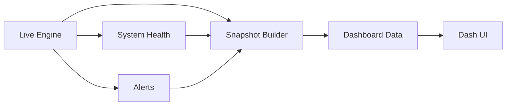

# Dashboard Flow

The dashboard aggregates system, portfolio, and regime state.

## Dashboard Pipeline

## What It Means

- The dashboard is built from periodic snapshots.
- Health metrics and alerts are included alongside PnL and positions.

## Interpretation

Interpretation: dashboard snapshots merge portfolio state with health and alert signals.

