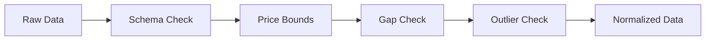

# Data Validation

Incoming market data is validated before use.

## Validation Pipeline

## What It Means

- Bad or incomplete data is caught early.
- You can choose to **skip**, **fill**, or **stop** on errors.

## Interpretation

Interpretation: validation ensures inputs are structurally correct and statistically reasonable before use.

