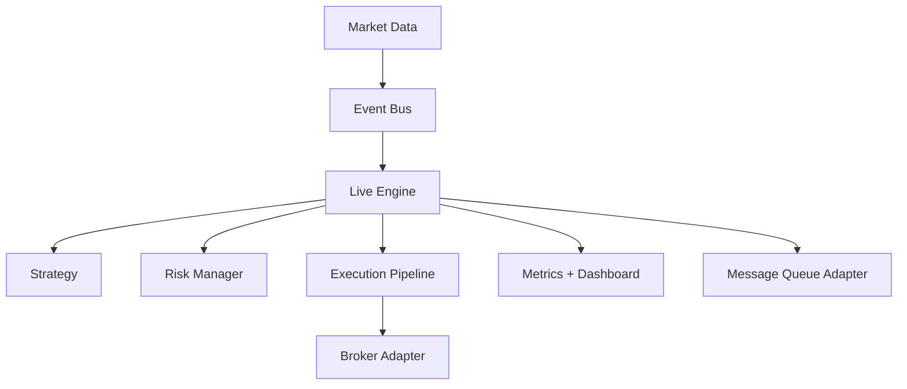

# Live Trading

This document describes the live engine, brokers, and resilience features.

## Live Engine Components

## Broker Integration

- **Alpaca** and **IB** are supported adapters.

### macOS IB Build Note
Interactive Brokers C++ client uses Intel’s BID decimal functions (`libbid`). On macOS, RegimeFlow will automatically fall back to a soft BID compatibility layer if `libbid` is not available. For the most accurate decimal behavior, install `libbid` and ensure it is visible at `/opt/homebrew/lib` or `/usr/local/lib`.
- Adapters normalize execution reports and market data into shared types.
- Reconnect backoff and heartbeat checks are enforced by the live engine.

## Message Queue

Optional adapters provide streaming resiliency and fan-out for:
- Market data
- Execution reports
- Position updates

## Interpretation

Interpretation: the live engine coordinates broker adapters, risk checks, and execution while publishing updates.
