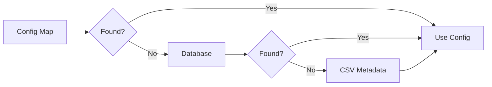

# Symbol Metadata Precedence

RegimeFlow resolves symbol metadata from multiple sources with a strict order.

## Precedence Flow

## What It Means

- If metadata exists in config, it wins.
- Otherwise the DB is used.
- If neither are available, CSV metadata is used.

## Interpretation

Interpretation: metadata resolution is deterministic using config, then DB, then CSV.

