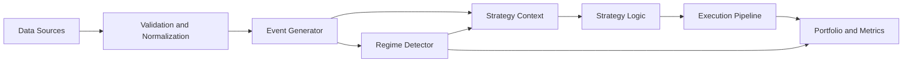

<section class="rf-hero">
  
Quant Engineering Platform

  <h1>RegimeFlow</h1>
  

    A production-oriented quantitative trading platform with a C++ execution core,
    Python bindings, regime-aware strategy infrastructure, and a documentation set
    designed for developers who need exact behavior, not hand-wavy marketing prose.
  

  

    <a class="rf-button rf-button-primary" href="getting-started/quickstart/">Run A Backtest</a>
    <a class="rf-button rf-button-secondary" href="live/overview/">Inspect Live Trading</a>
  

</section>

  

    Core Runtime
    C++ / Python
  

  

    Primary Focus
    Regime-Aware Research
  

  

    Execution Surface
    Backtest + Live
  

  

    Documentation Style
    Reference First
  

## Why This Documentation Exists

RegimeFlow is built for quant developers who need to move from idea to validated
execution without losing track of assumptions. The documentation is organized so
you can do two things quickly:

- reach a working backtest or live setup fast
- drill into the exact accounting, execution, regime, and broker semantics behind it

  Deterministic Backtesting
  Execution Realism
  Live Broker Adapters
  Python Automation
  API Traceability

## Fastest Path For Quant Developers

  

    <h3>1. Install And Run</h3>
    
Get the project running with the shortest path to a real backtest.

    <ul>
      <li><a href="getting-started/installation/">Installation</a></li>
      <li><a href="getting-started/quick-install/">Quick Install</a></li>
      <li><a href="getting-started/quickstart/">Quickstart</a></li>
    </ul>
  

  

    <h3>2. Learn The Quant Flow</h3>
    
Understand how data, strategies, regimes, risk, and execution fit together.

    <ul>
      <li><a href="guide/backtesting/">Backtesting</a></li>
      <li><a href="guide/regime-detection/">Regime Detection</a></li>
      <li><a href="guide/execution-models/">Execution Models</a></li>
    </ul>
  

  

    <h3>3. Work In Python</h3>
    
Use the bindings for research loops, automation, and dashboard tooling.

    <ul>
      <li><a href="python/overview/">Python Overview</a></li>
      <li><a href="python/workflow/">Python Workflow</a></li>
      <li><a href="tutorials/python-usage/">Python Usage</a></li>
    </ul>
  

  

    <h3>4. Verify The Live Boundary</h3>
    
Check broker config, resiliency, and what has been validated versus what is operationally gated.

    <ul>
      <li><a href="live/overview/">Live Overview</a></li>
      <li><a href="live/brokers/">Brokers</a></li>
      <li><a href="live/production-readiness/">Production Readiness</a></li>
    </ul>
  

  <h2>Project Map</h2>
  

    

      <h3>Getting Started</h3>
      
Install paths, quickstarts, and the repo layout for first contact.

    

    

      <h3>Quant Guide</h3>
      
Core workflows for backtesting, regime detection, risk, execution, and walk-forward analysis.

    

    

      <h3>Reference</h3>
      
Configuration keys, runtime flags, plugin contracts, and full API coverage.

    

    

      <h3>Explanation</h3>
      
Deeper engineering notes for event flow, portfolio state, risk math, and execution semantics.

    

  

## Architecture Summary

RegimeFlow keeps backtest and live flows aligned around one event pipeline:

## Start Here

  

    <h3>Run A Backtest</h3>
    
<a href="getting-started/quickstart/">Open the quickstart</a> if you want the shortest route from install to report.

  

  

    <h3>See Every Config Knob</h3>
    
<a href="reference/configuration/">Open the configuration reference</a> when you need exact field behavior.

  

  

    <h3>Work From Python</h3>
    
<a href="python/overview/">Open the Python overview</a> for bindings, CLI, and workflow entry points.

  

  

    <h3>Understand Live Constraints</h3>
    
<a href="live/overview/">Open the live overview</a> for broker adapters, readiness boundaries, and runtime expectations.

  

