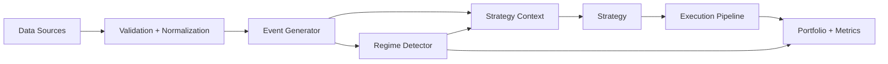

# RegimeFlow Documentation

RegimeFlow is a quantitative trading platform with a C++ core and Python bindings. It provides data ingestion and validation, regime detection, backtesting, and live execution with broker adapters. This documentation is structured like a production reference: short paths to get started, and deep references that stay aligned to the code.

## At A Glance

- **Core runtime**: C++ engine with consistent event pipeline for backtest and live.
- **Python API**: `regimeflow` bindings for research workflows and automation.
- **Regime-aware**: built-in HMM + ensemble detectors with pluggable detectors.
- **Extensible**: plugins for data sources, detectors, strategies, and execution models.

## Fastest Path For Quant Developers

1. Read the Quickstart to run a backtest end-to-end.
2. Learn the Backtest workflow and the data source options.
3. Configure a strategy and the regime detector.
4. Review risk limits and execution models.

Start here:
- `getting-started/quickstart.md`
- `guide/backtesting.md`
- `guide/data-sources.md`
- `guide/strategies.md`
- `guide/regime-detection.md`
- `guide/risk-management.md`
- `guide/execution-models.md`

## Project Map

- **Getting Started**: install, quickstart, and layout.
- **Quant Guide**: backtesting, data, strategies, regimes, risk, execution, walk-forward.
- **Python**: API overview, CLI, and workflows.
- **Live Trading**: configuration, brokers, and resiliency.
- **Reference**: configuration keys, data validation rules, and plugin interfaces.

## Architecture Summary

RegimeFlow processes market data through a consistent pipeline:

## Where To Go Next

- `getting-started/installation.md`
- `getting-started/quickstart.md`
- `reference/configuration.md`
- `python/overview.md`
- `live/overview.md`
