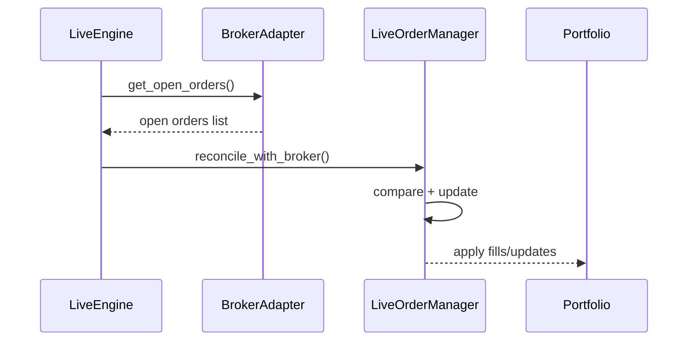

# Live Order Reconciliation (Detailed)

This section describes how RegimeFlow keeps internal order state aligned with broker reality.

## Reconciliation Sequence

## What It Means

- The engine periodically asks the broker for open orders.
- It compares broker state with internal state.
- Differences are resolved so the system always reflects reality.

## Interpretation

Interpretation: reconciliation compares broker truth to internal state and resolves mismatches.

