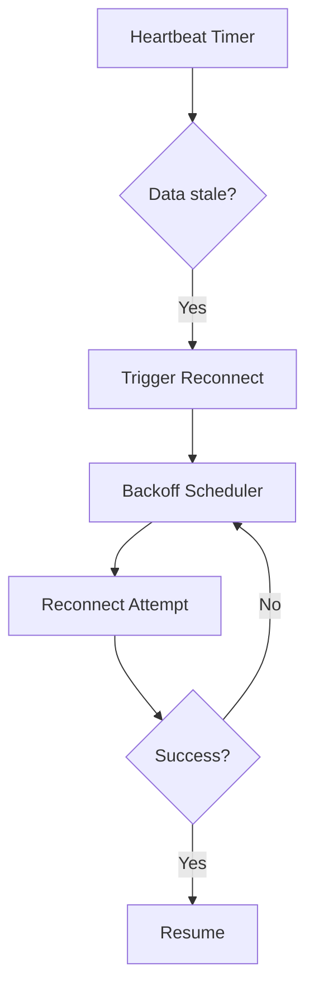

# Live Resiliency

The live engine monitors liveness and reconnects when needed.

```mermaid
flowchart TB
  A[Heartbeat Timer] --> B{Data stale?}
  B -- Yes --> C[Trigger Reconnect]
  C --> D[Backoff Scheduler]
  D --> E[Reconnect Attempt]
  E --> F{Success?}
  F -- Yes --> G[Resume]
  F -- No --> D
```

