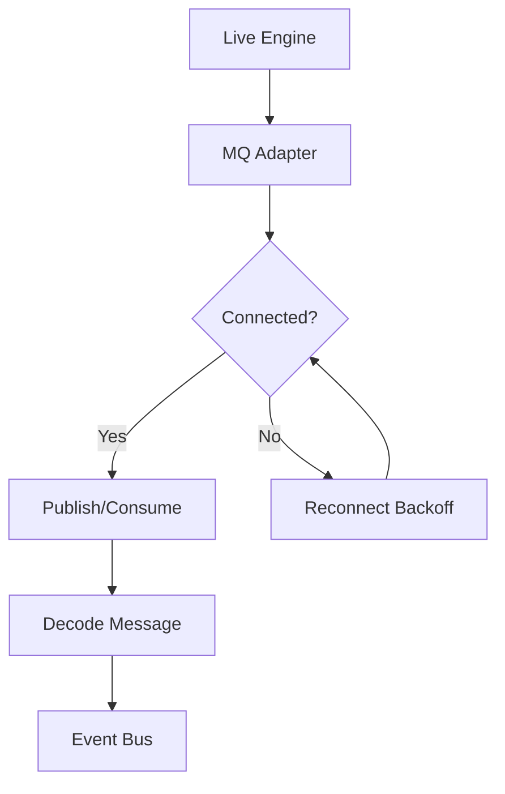

# Message Bus Resiliency

RegimeFlow can broadcast live updates through message queues like Redis Streams or Kafka.
This helps scale live trading across multiple processes.

## MQ Resiliency Flow

## What It Means

- If the queue is healthy, messages flow in real time.
- If it drops, the adapter retries with backoff (wait longer each time).
- When it reconnects, the stream resumes without restarting the engine.

## Interpretation

Interpretation: the adapter retries with exponential backoff and resumes once the queue is healthy.

