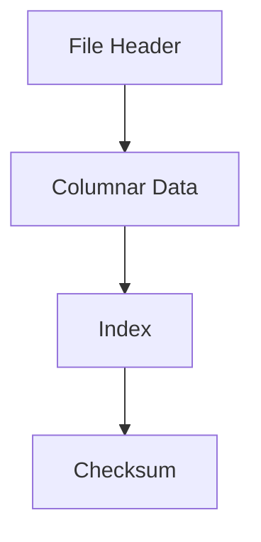

# Mmap Storage Layout

Memory‑mapped storage provides fast read‑only access to bars, ticks, and order books.

## File Structure

## What It Means

- Data is stored column‑by‑column for fast scanning.
- An index helps jump quickly to date ranges.
- A checksum verifies integrity.

## Interpretation

Interpretation: the file layout is optimized for fast scanning and range queries.

