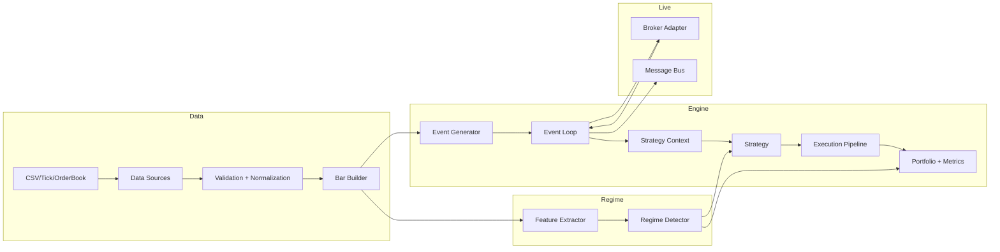

# Overview

RegimeFlow is a C++ core with Python bindings that provides:
- Data ingestion, validation, and canonicalization
- Backtesting and live trading engines
- Regime detection (HMM + ensembles) and regime-aware analytics
- Risk controls and execution models
- Broker adapters and message bus integration

The system is built around a consistent event pipeline that feeds data through
feature extraction, regime detection, strategy logic, execution models, and risk.

## System Map

## Key Ideas

1. Data flow is consistent between backtest and live. The same event types and
   execution logic are used for both, with adapters at the edges.
2. Regime detection is a first-class signal that can influence strategy selection,
   risk limits, and reporting.
3. Execution models are pluggable. Users can extend the execution layer without
   rewriting the rest of the system.

## Interpretation

Interpretation: the overview diagram shows the end‑to‑end flow from data ingestion through regime detection, strategy decisions, and execution.

