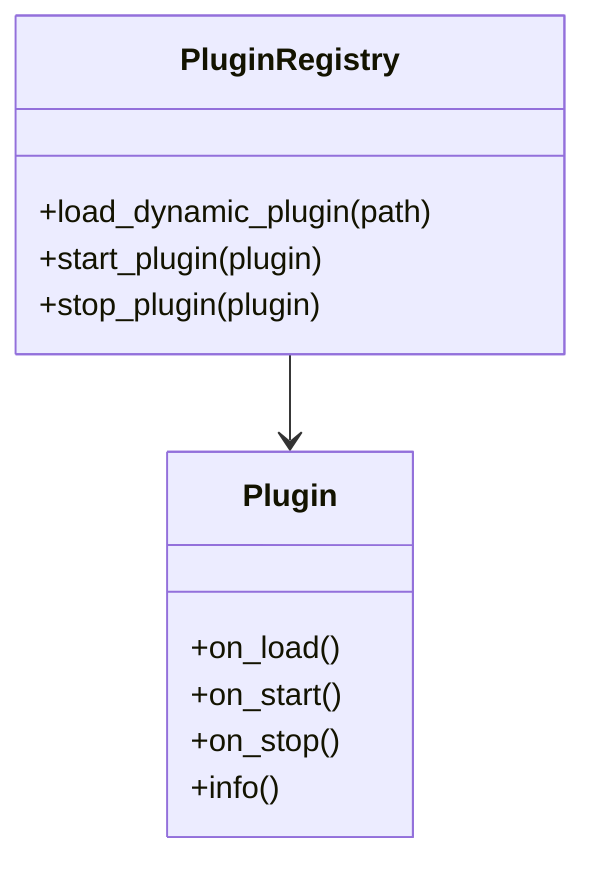

# Plugin API

Plugins allow external components to extend the engine without modifying core code.

## Plugin Interface

```mermaid
classDiagram
  class Plugin {
    +on_load()
    +on_start()
    +on_stop()
    +info()
  }

  class PluginRegistry {
    +load_dynamic_plugin(path)
    +start_plugin(plugin)
    +stop_plugin(plugin)
  }

  PluginRegistry --> Plugin
```

