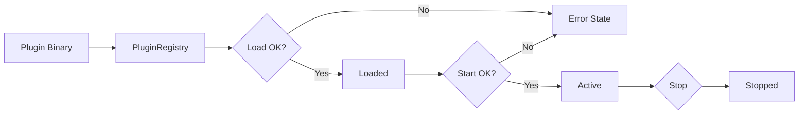

# Plugins

This section explains how plugins are discovered, loaded, and managed.

## Lifecycle Flow

## What It Means

- **PluginRegistry** is the manager that finds and loads plugins.
- If a plugin fails to load, it goes into an **Error State** and is ignored.
- When started successfully, the plugin becomes **Active** and can provide functionality.
- Plugins can be stopped cleanly without restarting the system.

## Interpretation

Interpretation: plugins are loaded and transitioned through states; errors isolate faulty plugins.

