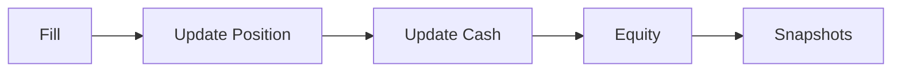

# Portfolio Model

This section explains how positions, cash, and PnL are tracked.

## Symbols

Let:
- $q_i$ = position quantity for symbol $i$
- $P_i$ = current price for symbol $i$
- $C$ = cash
- $E$ = equity

## Portfolio Flow

## Formulas (LaTeX)

**Market Value**

$$
\text{MV}_i = q_i P_i
$$

Interpretation: value of a single position.

**Equity**

$$
E = C + \sum_i \text{MV}_i
$$

Interpretation: total account value is cash plus all positions.

**Gross Exposure**

$$
G = \sum_i |\text{MV}_i|
$$

Interpretation: total absolute exposure across positions.

**Net Exposure**

$$
N = \sum_i \text{MV}_i
$$

Interpretation: directional exposure of the portfolio.

**Leverage**

$$
\text{Leverage} = \frac{G}{E}
$$

Interpretation: how much exposure is taken per unit of equity.
