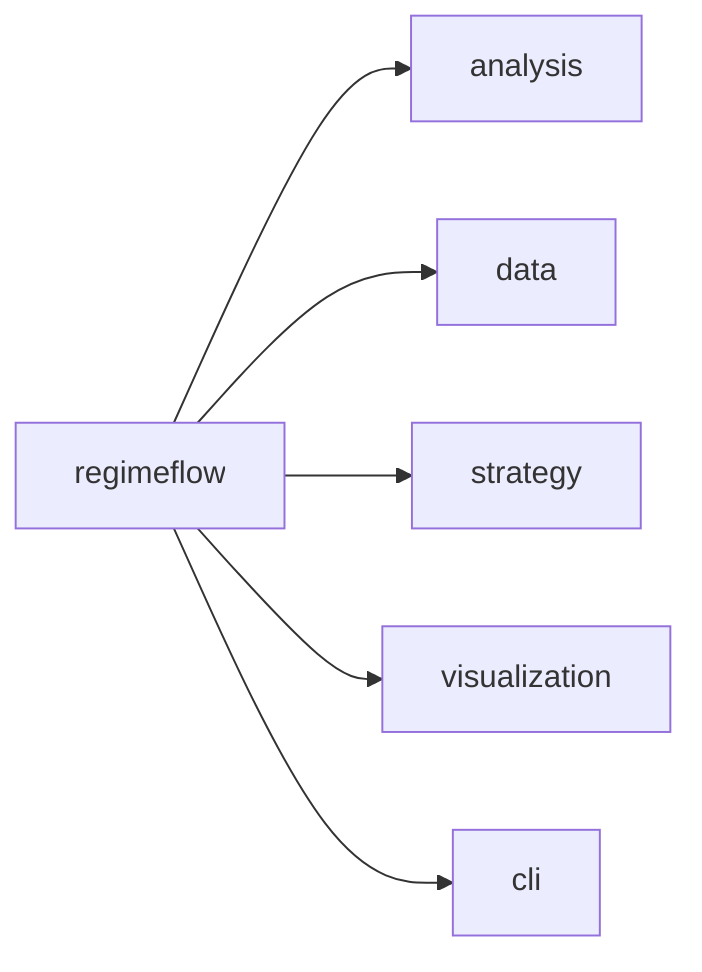
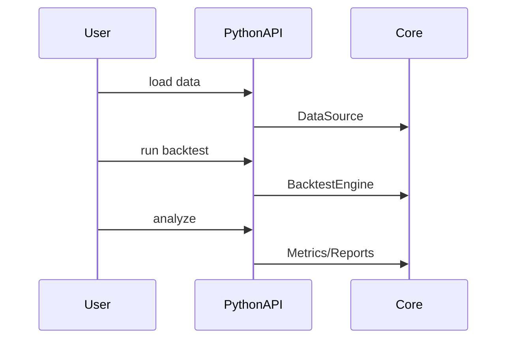

# Python Interfaces

Python bindings expose the core engine, data sources, metrics, and plotting helpers.

## Package Structure

## Typical Workflow

## Interpretation

Interpretation: Python calls map directly into the same engine used in C++.

