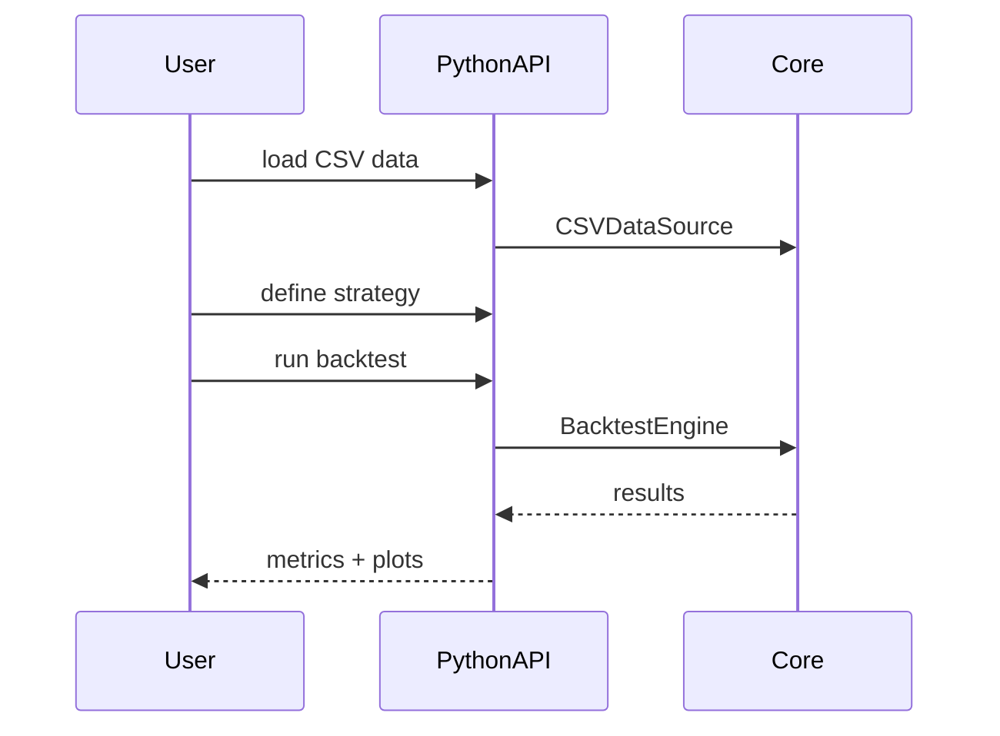

# Python Usage

This section shows how a user would typically run a backtest from Python.

```mermaid
sequenceDiagram
  participant User
  participant PythonAPI
  participant Core

  User->>PythonAPI: load CSV data
  PythonAPI->>Core: CSVDataSource
  User->>PythonAPI: define strategy
  User->>PythonAPI: run backtest
  PythonAPI->>Core: BacktestEngine
  Core-->>PythonAPI: results
  PythonAPI-->>User: metrics + plots
```

