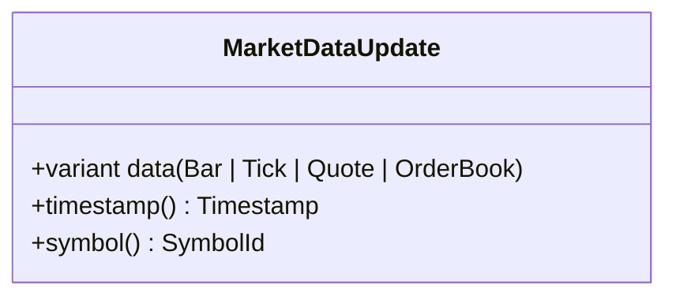
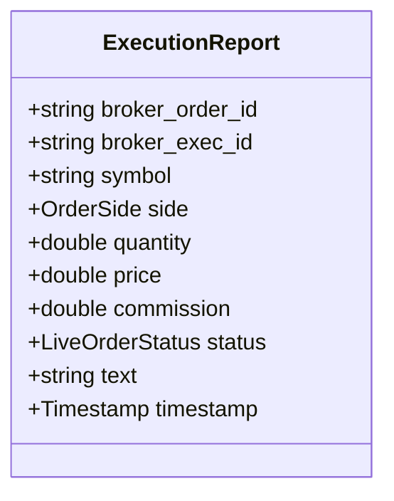
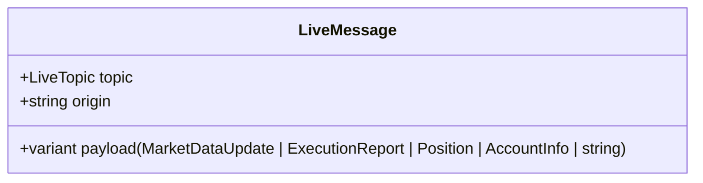

# Broker Message Types

This reference documents the normalized live message types that flow through the broker adapters, event bus, and live engine.

## Live Topics

`LiveTopic` values (from `live/event_bus.h`):

- `MarketData`
- `ExecutionReport`
- `PositionUpdate`
- `AccountUpdate`
- `System`

## MarketDataUpdate

Defined in `live/types.h`:

- `data`: variant of `Bar`, `Tick`, `Quote`, or `OrderBook`.
- `timestamp()` extracts the event timestamp from the payload.
- `symbol()` extracts the symbol ID from the payload.

## ExecutionReport

Defined in `live/broker_adapter.h`:

- `broker_order_id` broker-native order identifier.
- `broker_exec_id` broker-native execution identifier.
- `symbol` string symbol.
- `side` buy/sell.
- `quantity` fill quantity.
- `price` fill price.
- `commission` commission paid.
- `status` live order status.
- `text` broker status/diagnostic message.
- `timestamp` event timestamp.

## LiveOrderStatus

Live order statuses are normalized in `live/broker_adapter.h`:

- `PendingNew`
- `New`
- `PartiallyFilled`
- `Filled`
- `PendingCancel`
- `Cancelled`
- `Rejected`
- `Expired`
- `Error`

## Position

Defined in `live/types.h`:

- `symbol` string.
- `quantity` double.
- `average_price` double.
- `market_value` double.

## AccountInfo

Defined in `live/types.h`:

- `equity` double.
- `cash` double.
- `buying_power` double.

## LiveMessage Wrapper

All broker events flow through `LiveMessage` (in `live/event_bus.h`):

## Delivery Flow

1. Broker adapter parses raw broker messages into `MarketDataUpdate` and `ExecutionReport`.
2. `LiveTradingEngine` enqueues and dispatches updates.
3. `EventBus` routes events to subscribers by `LiveTopic`.
