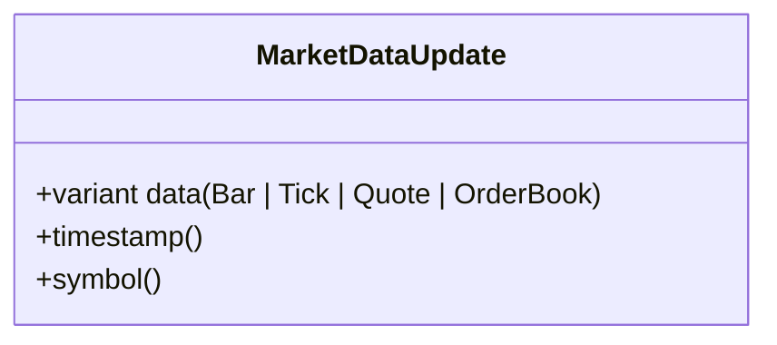

# Broker Message Types

This section documents the normalized message structures RegimeFlow uses internally.

## MarketDataUpdate

```mermaid
classDiagram
  class MarketDataUpdate {
    +variant data (Bar | Tick | Quote | OrderBook)
    +timestamp()
    +symbol()
  }
```

