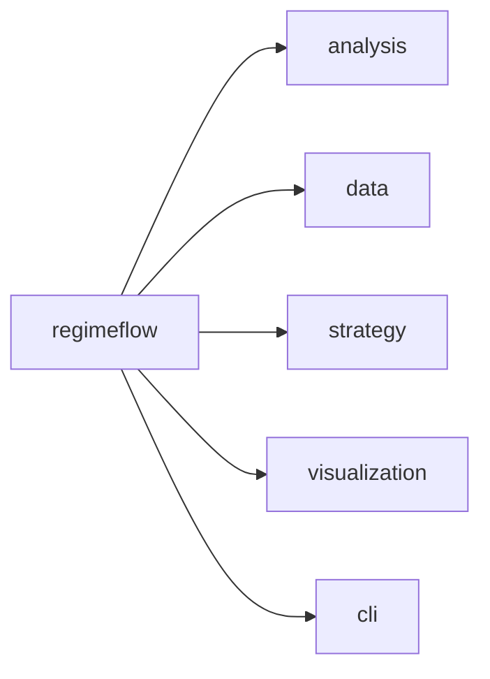
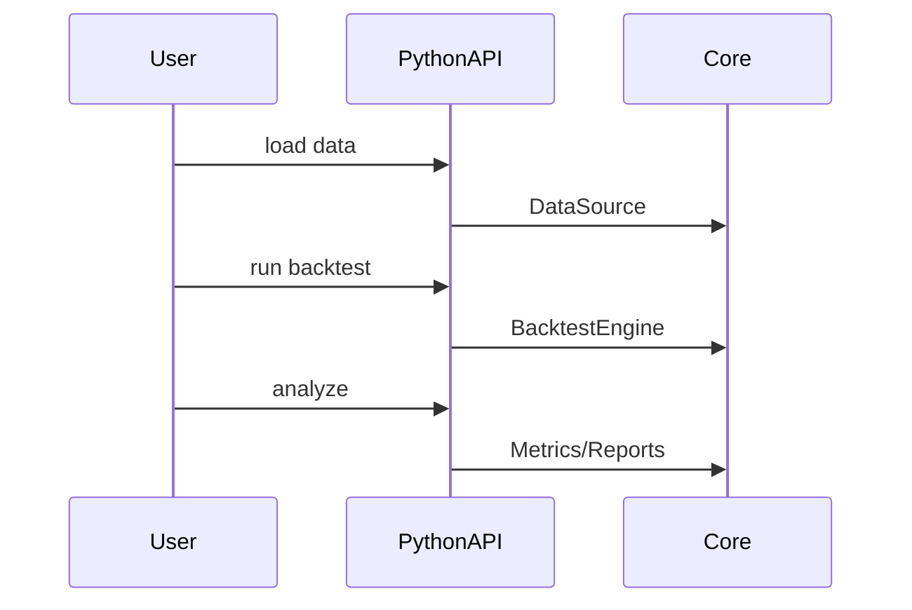

# Python Interfaces

Python bindings expose the core engine, data sources, metrics, and plotting helpers.

## Package Structure



## Plugin Loading (Python)

Python backtests can load native plugins by passing search paths and explicit plugin filenames
through `BacktestConfig` (or YAML).

```python
import regimeflow as rf

cfg = rf.BacktestConfig.from_yaml("examples/python_engine_regime/config_custom_plugin.yaml")
cfg.plugins_search_paths = ["examples/plugins/custom_regime/build"]
cfg.plugins_load = ["libcustom_regime_detector.so"]
```

YAML equivalent:

```yaml
plugins:
  search_paths:
    - examples/plugins/custom_regime/build
  load:
    - libcustom_regime_detector.so
```

## Transformer Regime Notes

- `examples/python_transformer_regime/` provides a transformer-style Python regime model.
- `examples/plugins/transformer_regime/` shows a CSV-backed regime detector plugin.
- `docs/reference/transformer_regime_plugin.md` outlines a TorchScript-backed detector design.

Custom detectors can emit any regime label set (e.g., `risk_on`, `risk_off`, `sideways`), and your strategies
can map those labels to different decision logic or strategy selection.

## Typical Workflow




## Interpretation

Interpretation: Python calls map directly into the same engine used in C++.
