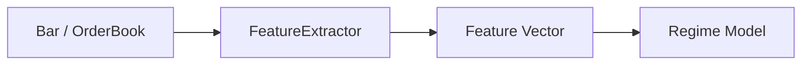

# Regime Features

This section documents the exact features used by the regime engine and how they are computed.

## Feature Pipeline

## Symbols

Let:
- $C_t$ = close price at time $t$
- $C_{t-1}$ = previous close
- $H_t$ = high price at time $t$
- $L_t$ = low price at time $t$
- $V_t$ = volume at time $t$
- $\mu_x$ = mean of series $x$ in the window
- $\sigma_x$ = standard deviation of series $x$ in the window
- $\text{mid} = \frac{bid + ask}{2}$

## Feature Definitions (LaTeX)

**Return**
$$
\text{Return}_t = \frac{C_t - C_{t-1}}{C_{t-1}}
$$
Interpretation: percent change in price from the previous bar.

**LogReturn**
$$
\text{LogReturn}_t = \ln\left(\frac{C_t}{C_{t-1}}\right)
$$
Interpretation: log‑scaled price change, useful for aggregation.

**Volatility**
$$
\text{Volatility}_t = \sigma_{\text{Return}}
$$
Interpretation: standard deviation of recent returns.

**Volume**
$$
\text{Volume}_t = V_t
$$
Interpretation: raw traded volume.

**VolumeZScore**
$$
\text{VolumeZ}_t = \frac{V_t - \mu_V}{\sigma_V}
$$
Interpretation: how unusual current volume is versus recent history.

**Range**
$$
\text{Range}_t = H_t - L_t
$$
Interpretation: price spread within a bar.

**RangeZScore**
$$
\text{RangeZ}_t = \frac{\text{Range}_t - \mu_{\text{Range}}}{\sigma_{\text{Range}}}
$$
Interpretation: how unusual the bar range is.

**VolumeRatio**
$$
\text{VolumeRatio}_t = \frac{V_t}{\mu_V}
$$
Interpretation: current volume relative to its recent mean.

**VolatilityRatio**
$$
\text{VolatilityRatio}_t = \frac{\text{Volatility}_t}{\mu_{\text{Volatility}}}
$$
Interpretation: current volatility relative to its recent mean.

**OnBalanceVolume (OBV)**
$$
\text{OBV}_t = \text{OBV}_{t-1} + \begin{cases}
+V_t, & \text{Return}_t > 0 \\
-V_t, & \text{Return}_t < 0 \\
0, & \text{Return}_t = 0
\end{cases}
$$
Interpretation: cumulative signed volume based on price direction.

**UpDownVolumeRatio**
$$
\text{UpDownRatio}_t = \frac{\sum V_{+}}{\sum |V|}
$$
Interpretation: fraction of volume on up moves vs total signed volume.

**BidAskSpread**
$$
\text{Spread}_t = \frac{ask - bid}{\text{mid}}
$$
Interpretation: relative spread scaled by mid price.

**SpreadZScore**
$$
\text{SpreadZ}_t = \frac{\text{Spread}_t - \mu_{\text{Spread}}}{\sigma_{\text{Spread}}}
$$
Interpretation: how unusual the spread is.

**OrderImbalance**
$$
\text{Imbalance}_t = \frac{bid\_qty - ask\_qty}{bid\_qty + ask\_qty}
$$
Interpretation: imbalance of resting liquidity.

**MarketBreadth / SectorRotation / CorrelationEigen / RiskAppetite**

These are externally supplied cross‑asset signals provided by upstream analytics.

## Normalization Modes

**ZScore**
$$
Z = \frac{x - \mu_x}{\sigma_x}
$$
Interpretation: standardized value within its history window.

**MinMax**
$$
\text{MinMax} = \frac{x - x_{min}}{x_{max} - x_{min}}
$$
Interpretation: scales values to $[0,1]$.

**Robust**
$$
\text{Robust} = \frac{x - \text{median}}{IQR}
$$
Interpretation: reduces sensitivity to outliers.
