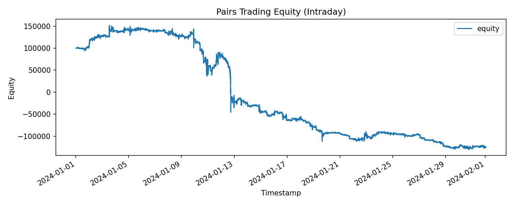
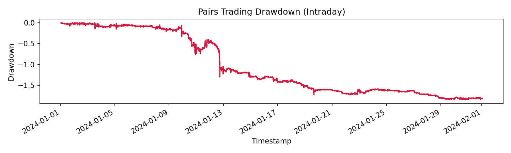
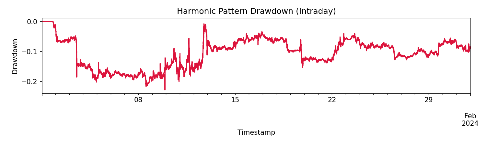

# Intraday Trade Check: Pairs + Harmonic

This report captures the latest intraday runs using the BTCUSDT/ETHUSDT dataset.

## Configs

- Pairs trading: `examples/backtest_intraday_pairs.yaml`
- Harmonic pattern: `examples/backtest_intraday_harmonic.yaml`

## Summary

- `pairs_trading` produced 40759 trades.
- `harmonic_pattern` produced 60 trades.

Notes:
- Updated cooldown logic now uses an absolute bar index (not `recent_bars().size()`), which
  allows repeated entries/exits on intraday data.

## Artifacts

- `examples/backtest_intraday_pairs_report.json`
- `examples/backtest_intraday_pairs_equity.png`
- `examples/backtest_intraday_pairs_drawdown.png`
- `examples/backtest_intraday_harmonic_report.json`
- `examples/backtest_intraday_harmonic_equity.png`
- `examples/backtest_intraday_harmonic_drawdown.png`

JSON reports (direct links):
- [Pairs Report](../assets/backtest_intraday_pairs_report.json)
- [Harmonic Report](../assets/backtest_intraday_harmonic_report.json)

## Pairs Trading Plots




## Harmonic Pattern Plots




## Commands

```bash
PYTHONPATH=python:build/lib .venv/bin/python - <<'PY'
import regimeflow as rf

cfg_pairs = rf.BacktestConfig.from_yaml('examples/backtest_intraday_pairs.yaml')
engine_pairs = rf.BacktestEngine(cfg_pairs)
results_pairs = engine_pairs.run('pairs_trading')
print('pairs_trading trades:', results_pairs.num_trades)
print(results_pairs.report_json())

cfg_h = rf.BacktestConfig.from_yaml('examples/backtest_intraday_harmonic.yaml')
engine_h = rf.BacktestEngine(cfg_h)
results_h = engine_h.run('harmonic_pattern')
print('harmonic_pattern trades:', results_h.num_trades)
print(results_h.report_json())
PY
```
