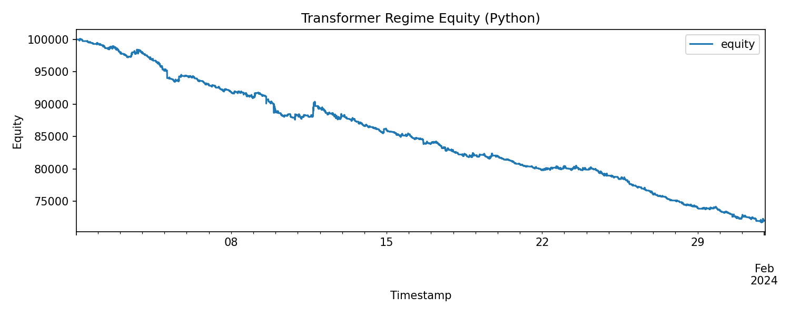
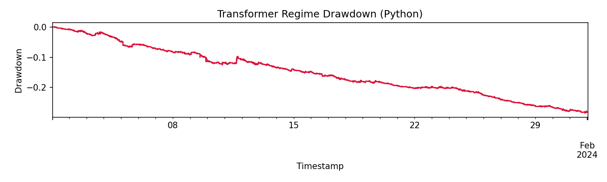

# Transformer Regime Report

This report captures the Python transformer-regime backtest and the artifacts generated from it.

## Artifacts

- `docs/assets/transformer_report.json`
- `docs/assets/transformer_equity.png`
- `docs/assets/transformer_drawdown.png`

## Plots




## Run Command

```bash
PYTHONPATH=python:build/lib .venv/bin/python \
  examples/python_transformer_regime/run_python_transformer_strategy.py \
  --config examples/python_transformer_regime/config.yaml
```
