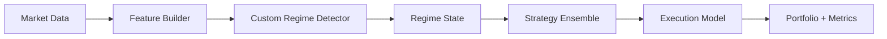
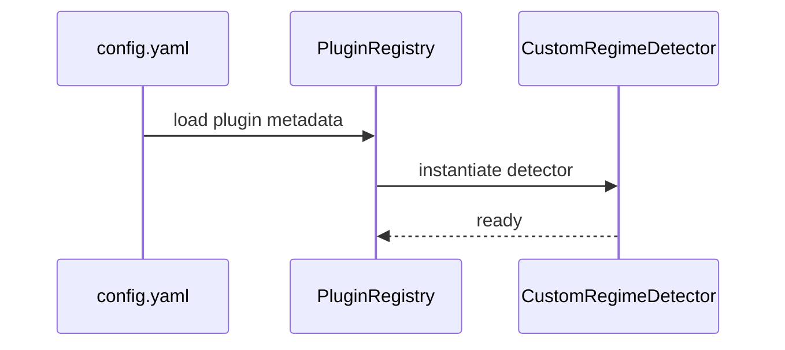
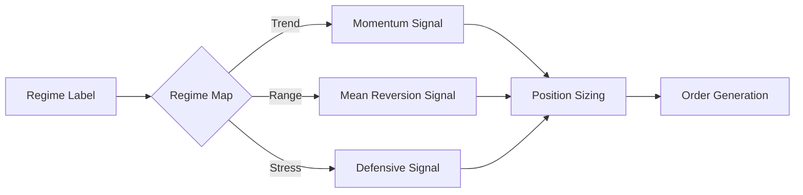

# Quant Workflow: Custom Regime Model + Complex Strategy

This workflow walks through building a **custom regime detector**, defining its **feature set**, and wiring a **complex strategy** into RegimeFlow. It includes configuration, plugin registration, and execution flow diagrams.

## 1. Define Regime Features

Start by deciding which features determine regimes. Common choices:
- Trend + volatility
- Momentum + dispersion
- Liquidity + drawdown

Example feature plan (daily bars):
- `trend_20`: 20-day return
- `vol_20`: 20-day realized volatility
- `drawdown_60`: 60-day drawdown

Related:
- [Regime Features](../explanation/regime-features.md)
- [HMM Math](../explanation/hmm-math.md)

## 2. Implement a Custom Regime Detector (Plugin)

Create a detector that consumes feature vectors and outputs a regime label.

Pseudo‑API (conceptual):
```
class CustomRegimeDetector : public RegimeDetector {
public:
  void fit(const FeatureMatrix& X) override;
  RegimeState predict(const FeatureVector& x) override;
};
```

Register your detector in the plugin system:
```
plugins:
  - name: my_custom_regime
    type: regime_detector
    shared_library: build/plugins/libmy_custom_regime.so
```

Related:
- [Plugin API](../reference/plugin-api.md)
- [Regime Detection](../explanation/regime-detection.md)

## 3. Configure Regime Model and Features

Configure the detector and pass feature params:
```
regime:
  detector: my_custom_regime
  params:
    feature_set: trend_vol_drawdown
    window: 60

features:
  trend_20: true
  vol_20: true
  drawdown_60: true
```

## 4. Build a Complex Strategy

Design a strategy that is **regime‑aware** and **multi‑signal**:

Inputs:
- Regime label (e.g., Trend, Range, Stress)
- Signal ensemble (momentum + mean reversion + carry)
- Risk throttles (volatility & drawdown)

Example strategy config:
```
strategy: my_regime_ensemble
strategy_params:
  regime_map:
    Trend: momentum
    Range: mean_reversion
    Stress: defensive
  signal_weights:
    momentum: 0.6
    mean_reversion: 0.3
    carry: 0.1
  throttle:
    max_vol: 0.18
    max_dd: 0.10
```

Related:
- [Strategy Selection](../explanation/strategy-selection.md)
- [Execution Models](../explanation/execution-models.md)

## 5. Wire Everything into the Backtest

Complete backtest config (minimal excerpt):
```
data_source: mmap
data:
  root_dir: /data/mmap
  symbols: AAPL,MSFT

regime:
  detector: my_custom_regime
  params:
    feature_set: trend_vol_drawdown
    window: 60

strategy: my_regime_ensemble
strategy_params:
  regime_map:
    Trend: momentum
    Range: mean_reversion
    Stress: defensive

execution_model: basic
risk:
  max_symbol_exposure: 0.2
  max_drawdown: 0.15
```

## 6. Run and Validate

Run the backtest:
```
./build/bin/regimeflow_backtest --config configs/regime_ensemble.yaml
```

Validate regime attribution:
```
import regimeflow as rf
from regimeflow.metrics.validation import validate_regime_attribution

cfg = rf.BacktestConfig.from_yaml("configs/regime_ensemble.yaml")
engine = rf.BacktestEngine(cfg)
results = engine.run("my_regime_ensemble")
validate_regime_attribution(results)
```

Related:
- [Performance Metrics](../explanation/performance-metrics.md)
- [Metrics Validation](../api/python-metrics-validation.md)

---

## Diagram: Custom Regime + Strategy Flow



## Diagram: Plugin Registration



## Diagram: Regime-Aware Strategy Routing


